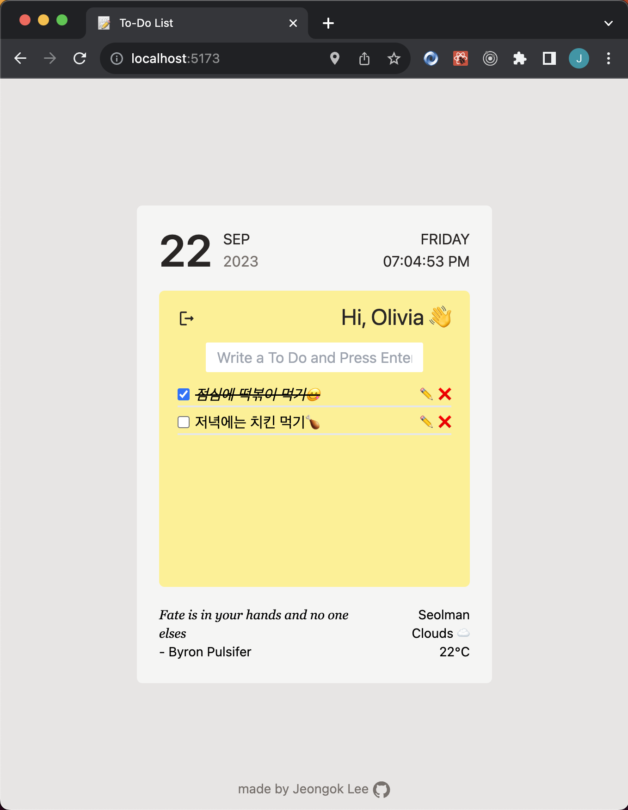

# Welcome to My To-Do List Project!

## https://teenytiny-todolist.netlify.app

This is a small and simple to-do list created with React. The time and weather are updated in real-time, and every time you refresh, a new inspirational quote appears. Utilizing local storage, your task list will remain intact until you log out. 😊

리액트로 만든 작은 to-do list입니다. 시간과 날씨는 실시간으로 업데이트되며, 새로고침할 때마다 새로운 격언이 나타납니다. 로컬스토리지를 활용하여 로그아웃하기 전까지는 작성한 목록이 그대로 유지됩니다. 😊
